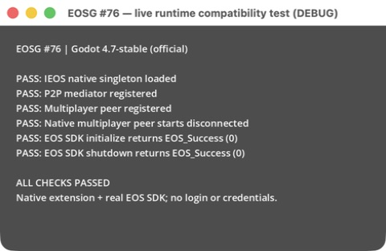
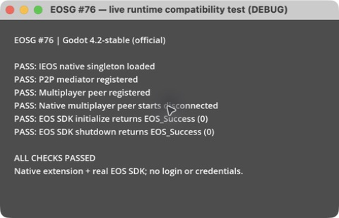

# Issue #76 — reproduction and fix evidence

**Confirmed:** compiling EOSG with newer godot-cpp fails because `CharString` no
longer implicitly converts to `const char *`. The original code fails and the
fixed code builds successfully against the same newer headers.

- Original EOSG source: `d1bbabe953bd8076ee2341623aacd3e17de57c05`.
- Fixed source: `8cb38e7c159e06a3de2412dd5c3ea6841c497990` (based on current main; intervening changes were README only).
- New godot-cpp: `6cceaf6a5f8b0d78ac5d71c139fd7fabba43b918`, API 4.7.
- Normal pinned godot-cpp: `54136ee8357c5140a3775c54f08db5f7deda2058`, API 4.2.
- Real EOS SDK 1.19.1, macOS universal builds; runtime tests on Apple Silicon.

## What was reproduced

The actual compiler reports:

```text
error: no matching function for call to 'eosg_string_to_product_user_id'
note: candidate function not viable: no known conversion from 'CharString'
(aka 'CharStringT<char>') to 'const char *' for 1st argument
```

[Original focused failure](before-regression.log),
[second reproduction in the server interface](before-modern-target.log), and
[compilation of every original EOSG translation unit](before-all-sources.log).
These are real compiler outputs, not mocked headers or a fabricated transcript.
The parallel all-source log includes interleaved diagnostics; the focused log is
sequential and easier to read.

The upstream removal is in
[godot-cpp commit 867efda](https://github.com/godotengine/godot-cpp/commit/867efda3c9786b8d3a86e97bbfc1bc8a3e83750c).
The bindings initially synchronized to Godot 4.7 stable (`5ffd70e`) still have the
implicit operator. This is a newer **godot-cpp source-build** incompatibility,
not evidence that switching to the Godot 4.7 executable breaks existing binaries.

## Build results

| Check | Exit code | Evidence |
| --- | ---: | --- |
| Original focused regression, newer godot-cpp | 2 (expected failure) | [Log](before-regression.log) |
| Fixed focused regression, same godot-cpp | 0 | [Log](after-regression.log) |
| Fixed complete newer-godot-cpp build | 0 | [Log](after-modern-full-build.log) |
| Fixed complete pinned-4.2 build | 0 | [Log](after-pinned-4.2-full-build.log) |
| Required `scons dev_build=yes` | 0 | [Log](required-build.log) |

Commands, run from the fix checkout:

```sh
# Newer godot-cpp setup in a disposable checkout:
git -C godot-cpp checkout --detach 6cceaf6a5f8b0d78ac5d71c139fd7fabba43b918
ln -s extension_api-4-7.json godot-cpp/gdextension/extension_api.json
./tests/check_charstring_compatibility.sh api_version=4.7 -j1
scons dev_build=yes api_version=4.7 -j8

# Then restore the pinned godot-cpp revision (remove that local symlink first):
git -C godot-cpp checkout --detach 54136ee8357c5140a3775c54f08db5f7deda2058
scons dev_build=yes -j8
scons dev_build=yes
```

The API-JSON symlink is only local test setup for the newer godot-cpp build
system. The PR leaves the repository's dependency pin intact. Existing unrelated
compiler warnings remain visible in the raw logs.

## Runtime results

The pinned-4.2 binary was loaded by every installed Godot 4.x executable below.
Each test checked both native singletons, native peer registration/construction,
and real EOS SDK initialization and shutdown. No sample credentials, online
login, anti-cheat service session, or network multiplayer session was used.

| Actual installed engine | Exit code | Evidence |
| --- | ---: | --- |
| 4.2.stable.official.46dc27791 | 0 | [Raw log](runtime-pinned-godot42.log) |
| 4.3.stable.official.77dcf97d8 | 0 | [Raw log](runtime-pinned-godot43.log) |
| 4.4.stable.official.4c311cbee | 0 | [Raw log](runtime-pinned-godot44.log) |
| 4.5.2.stable.official.6ce3de25a | 0 | [Raw log](runtime-pinned-godot45.2.log) |
| 4.6.2.stable.official.71f334935 | 0 | [Raw log](runtime-pinned-godot46.2.log) |
| 4.6.3.stable.official.7d41c59c4 | 0 | [Raw log](runtime-pinned-godot46.3.log) |
| 4.7.stable.official.5b4e0cb0f | 0 | [Raw log](runtime-pinned-godot47.log) |
| 4.6.3.stable.mono.official.7d41c59c4 | 0 | [Raw log](runtime-pinned-godot4mono.log) |

Additionally, the binary built against newer godot-cpp / API 4.7 passed the same
checks in Godot 4.7: [raw log](runtime-modern-4.7.log).

Reproduce any runtime check with:

```sh
python3 tests/run_runtime_smoke.py /Applications/godot47.app/Contents/MacOS/Godot
```

### Unedited screenshots of actual Godot test windows

Godot 4.7, binary built against newer godot-cpp:



Godot 4.2, binary built against pinned godot-cpp 4.2:



The windows display the assertions executed by `tests/runtime_smoke.gd` in the
running engine. They are not screenshots of a separately rendered report.
The corresponding interactive stdout is preserved in
[4.7 window log](runtime-modern-4.7-window.log) and
[4.2 window log](runtime-pinned-4.2-window.log).
The authoritative runtime exit codes above come from headless runs.

## Scope and provenance

Compilation exercises all changed C++ call sites. Runtime checks establish
extension loading and offline SDK lifecycle compatibility; they do not establish
online gameplay or anti-cheat behavior. Both CPU architectures were compiled,
but runtime execution was on arm64. Other operating systems were not tested
locally.

[Environment metadata](environment.json) includes compiler and engine versions,
exact dependency commits, and SHA-256 hashes of the two built extension binaries.
[SHA256SUMS](SHA256SUMS) covers the attached evidence. SDK binaries and credentials
are not published here.
