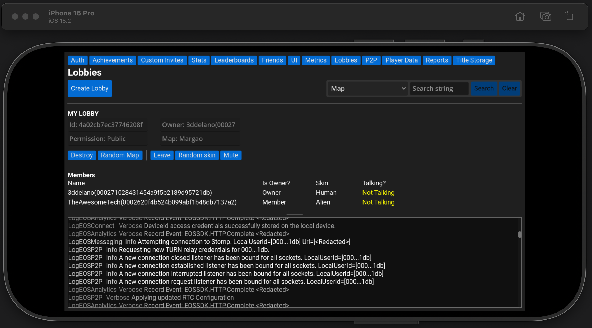

Epic Online Services Godot (EOSG)
=========================================


### Easiest way to use Epic Online Services in Godot 4.3 (includes demo project)

&nbsp;&nbsp;&nbsp;

> Supports Windows x64, Linux x64/arm64, Android x64/arm64, MacOS, iOS arm64 (iphone/simulator)

> Disclaimer: This project is NOT affiliated with Epic Games Inc or Godot Engine. It doesn't endorse Epic Online Services. This project and sample Godot scenes are provided solely for educational purposes and may or may not comply with Epic Games' Design Guidelines, if you plan to release a game make sure you read the [Guidelines](https://dev.epicgames.com/docs/services/en-US/EpicAccountServices/DesignGuidelines/index.html) and any other steps needed to release a public game like asking for user consent, option to delete user data, website with privacy policy and license, etc.


## This plugin has two main systems:
- ### High Level EOS (Recommended)
  The High Level Epic Online Services provides easy to use methods and signals to interact with EOS recommended for beginners.

- ### GDExtension EOS
  The GDExtension EOS provides advanced EOS usage not recommended for beginners. See `EOS` and `IEOS` classes.


# High Level Epic Online Services

Following are the main classes in High Level Epic Online Services. They also have documentation in the Godot Editor:

- ### HPlatform
- ### HAuth
- ### HAchievements
- ### HFriends
- ### HStats
- ### HLeaderboards
- ### HLobbies
- ### HLog

A basic example of using High Level EOS:

```GDScript
# In main script
extends Node

func _ready() -> void:
	var init_opts = EOS.Platform.InitializeOptions.new()
	init_opts.product_name = "PRODUCT_NAME_HERE"
	init_opts.product_version = "PRODUCT_VERSION_HERE"

	var create_opts = EOS.Platform.CreateOptions.new()
	create_opts.product_id = "PRODUCT_ID_HERE"
	create_opts.sandbox_id = "SANDBOX_ID_HERE"
	create_opts.deployment_id = "DEPLOYMENT_ID_HERE"
	create_opts.client_id = "CLIENT_ID_HERE"
	create_opts.client_secret = "CLIENT_SECRET_HERE"
	create_opts.encryption_key = "ENCRYPTION_KEY_HERE"

	# Enable Social Overlay on Windows
	if OS.get_name() == "Windows":
		create_opts.flags = EOS.Platform.PlatformFlags.WindowsEnableOverlayOpengl

	# Initialize the SDK
	var init_res := await HPlatform.initialize_async(init_opts)
	if not EOS.is_success(init_res):
		printerr("Failed to initialize EOS SDK: ", EOS.result_str(init_res))
		return
	
	# Create platform
	var create_success := await HPlatform.create_platform_async(create_opts)
	if not create_success:
		printerr("Failed to create EOS Platform")
		return

	# Setup Logs from EOS
	HPlatform.log_msg.connect(_on_eos_log_msg)
	var log_ret := HPlatform.set_eos_log_level(EOS.Logging.LogCategory.AllCategories, EOS.Logging.LogLevel.Verbose)
	if not log_ret:
		printerr("Failed to set logging level")
		return

	HAuth.logged_in.connect(_on_logged_in)

	# During development use the devauth tool to login
	HAuth.login_devtool_async("localhost:4545", "CREDENTIAL_NAME_HERE")

	# Only on mobile device (Login without any credentials)
	# await HAuth.login_anonymous_async()


func _on_logged_in():
	print("Logged in successfully: product_user_id=%s" % HAuth.product_user_id)

	# Example: Get top records for a leaderboard
	var records := await HLeaderboards.get_leaderboard_records_async("LEADERBOARD_ID_HERE")
	print(records)


func _on_eos_log_msg(msg: EOS.Logging.Message) -> void:
	print("SDK %s | %s" % [msg.category, msg.message])

```

# GDextension Epic Online Services

## Features

- Authentication (Epic Games, Steam, Discord, Anonymous etc)
- Social Overlay on Windows
- Achievements
- Stats & Leaderboards
- Lobby, Sessions and Multiplayer
- Voice
- Metrics
- Mods
- Player/Title data storage
- Progression Snapshot
- Reports and Sanctions
- Ecommerce (Ecom Epic Games Store)
- AntiCheat

#### [View Current Project Status](#current-project-status)

## Simple P2P Example

A simple demo showcasing P2P multiplayer using Epic Online Services: [Click Here](https://github.com/LowFire/EOSGP2PInterfaceTestGame)

## Support Development

#### Making this project took a lot of time and effort, reading the Epic Online Services documentation countless times and testing each method in Godot. I would really appreciate if you could support the project in any way.

<a href="https://www.buymeacoffee.com/3ddelano" target="_blank"></a>
<br>
<a href="https://github.com/sponsors/3ddelano" target="_blank">Github Sponsor</a>

#### Want to support in other ways? Contact me on Discord: `@3ddelano`

Join the Discord server for discussing suggestions or bugs: [3ddelano Cafe](https://discord.gg/FZY9TqW)


## [Demo Video (Youtube)](https://www.youtube.com/watch?v=ENyvF4yVjKg)
[Watch the playlist](https://www.youtube.com/playlist?list=PL5t0hR7ADzun5JYF4e2a2FtZEWYHxK83_)

[](https://www.youtube.com/playlist?list=PL5t0hR7ADzun5JYF4e2a2FtZEWYHxK83_)


## [Documentation (Coming Soon)](#)

## Screenshots

- Windows
   

- Android
   

   

- iOS
   


- Cross platform lobbies
  
  - iOS
    
  - macOS
    


## How does it work

This project uses GDExtension to wrap the `Epic Online Services C SDK` so that it can be easily used in Godot using GDScript, C#, etc with similar class hierarchy and static type support. It makes use of signals for sending events like user login, logout, achievement unlock, etc.


Installation
--------------

This is a regular plugin for `Godot 4.3`. To install the plugin follow the steps below:

#### **Method 1: Install from Asset Library**

1. Asset Library link: [View the plugin on Godot Asset Library](https://godotengine.org/asset-library/asset/2453)
2. In the Godot editor, navigate to the `AssetLib` tab, and in the search bar type `EOSG`.
3. Click on the plugin with name `Epic Online Services Godot (EOSG)` by `3ddelano`
4. In the popup that opens, click the `Download` button.
5. Once the download is done, click the `Install` button.
6. Goto `Project->Project Settings->Plugins` and enable the `Epic Online Services Godot 4.3 (EOSG)` plugin.
7. Restart the godot editor.
8. You can now use the plugin. Head to the [Documentation](#) for more information on how to use the plugin.

#### **Method 2: Install from GitHub**

1. Goto the Releases section and download the [latest release](https://github.com/3ddelano/epic-online-services-godot/releases/latest)
2. Extract the zip file and copy the `addons/epic-online-services-godot` folder into the `res://addons/` folder of your project. If the `res://addons` does not exist, create it.
3. In the Godot editor, goto `Project->Project Settings->Plugins` and enable the `Epic Online Services Godot 4.3 (EOSG)` plugin.
4. Restart the godot editor.
5. You can now use the plugin. Head to the [Documentation](#) for more information on how to use the plugin.
    


Development Setup
--------------

#### Pre-requisites
- Godot Engine 4.3 (Get it here [Godot Engine Download](https://godotengine.org/download/))
- Epic Online Services C SDK (Download from [Epic Developer Portal](https://dev.epicgames.com/portal/sdk))
- Make sure you have accepted the Terms and Conditions for [Epic Online Services](https://www.epicgames.com/site/en-US/tos?lang=en-US)
- A product registered with Epic Games Services (Make one for free [Epic Developer Portal](https://dev.epicgames.com/portal))

To develop this plugin, follow the below steps:
1. Download/clone the repository.

2. Extract the `EOS C SDK` zip downloaded from Epic Games, rename it to `eos-sdk` and paste it in the `thirdparty/` folder. Refer to the below folder structure.
   
   

3. Build the GDExtension plugin in debug mode (With debug symbols)
   ```shell
   # In root folder
   scons platform=<platform> target=template_debug dev_build=yes
   ```
   Eg. `scons platform=windows target=template_debug dev_build=yes`

4. Build the GDExtension plugin for release (Optimized)
   ```shell
   # In root folder
   scons platform=windows target=template_release
   ```

5. The built GDExtension library will be in the `res://addons/epic-online-services-godot/bin/` folder of the sample project.

## Debugging GDExtension on MacOS

If you get an error `Not allowed to attach to process` trying to debug GDExtension on MacOS using LLDB. Run the below command:
```bash
codesign --entitlements debug-entitlements.plist -f -s - /Applications/Godot.app/Contents/MacOS/Godot
```

### How to run the sample project?
> The sample Godot project is located in the **Sample** folder

1. Clone/Download the repo.
2. Download the [latest release](https://github.com/3ddelano/epic-online-services-godot/releases/latest) from the Releases section and replace the existing `/addons/epic-online-services-godot` with the one from the Release (this includes the built shared libraries).
3. Copy your credentials (`Product Id`, `Sandbox Id`, `Deployment Id`, `Client Id`, `Client Secret`) of your Epic Games "Product" from the Epic Games Dev Portal and paste them in `Main.gd` script in the relevant sections. The encryption key is a random 64 character long string. These credentials need to be kept as private as possible. One way is to make sure to encrypt all scripts when exporting the final game. (See [Compiling with script key encryption](https://docs.godotengine.org/en/stable/development/compiling/compiling_with_script_encryption_key.html))

4. Configure your Product on the EOS Dev Portal with the following configuration:
  - In the `Client Policies` section in `Product Settings`, for the Client policy type choose `Custom policy`, enable the `User is required` and enable every features and action except `Connect` (Trusted Server Required). This will allow the sample to access the different services provided by Epic Online Services. In your actual game, the client policy is important and you should give minimal permissions to features.
  - In the `Permissions` section of `Epic Account Services`, enable all three: `Basic Profile`, `Online Presence` and `Friends`. 
  - (Optional if you want some pre-made achievements)
  In the `Achievements` section in `Game Services`, use the `Bulk Import` option and import the `HelloProduct.zip` file located at `res://HelloProduct.zip`

### Bootstrapping Godot executable with Epic Online Services
If you want to use the `Account Portal` login option in Epic Online Services, you need to bootstrap the Godot/Game executable as needed by `EOS-SDK 1.15` and greater. See [Redistributable Installer](https://dev.epicgames.com/docs/services/en-US/EpicAccountServices/Crossplayacrossplatforms/RedistributableInstaller/index.html)

A sample of the generated `.ini` file for the Godot Editor is shown below (during game development):
```
ApplicationPath=Godot_v4.3.0-stable_win64.exe
WorkingDirectory=
WaitForExit=0
NoOperation=0
```
Follow the instructions in [Running the service for local development](https://dev.epicgames.com/docs/services/en-US/EpicAccountServices/Crossplayacrossplatforms/RedistributableInstaller/index.html#runningtheserviceforlocaldevelopment) and:
- During game development
  
  Bootstrap the Godot Editor executable (eg. `Godot_v4.3.0-stable_win64.exe`) to test the `Account Portal` login
- After exporting the game
  
  Bootstrap the exported game executable (eg. `My Amazing Game.exe`)


## Exporting for Android

### Pre-requisites

1. Setup the `Android Build Template` in your Godot project by following the tutorial [Gradle builds for Andriod](https://docs.godotengine.org/en/stable/tutorials/export/android_gradle_build.html). This will create an android project in `res://android/build`.

2. Now with reference to the tutorial [Add the EOS SDK to Your Android Studio Project](https://dev.epicgames.com/docs/epic-online-services/platforms/android#4-add-the-eos-sdk-to-your-android-studio-project), perform the following steps.

3. In the `res://android/build/build.gradle` file, add the following lines after the implementations in the `dependencies` section.
    
    Before
    ```gradle
    dependencies {
        implementation libraries.kotlinStdLib
        implementation libraries.androidxFragment
        ... other code
    ```

    After
    ```gradle
    dependencies {
        implementation libraries.kotlinStdLib
        implementation libraries.androidxFragment
        
        // EOS SDK dependencies
        implementation 'androidx.appcompat:appcompat:1.5.1'
        implementation 'androidx.constraintlayout:constraintlayout:2.1.4'
        implementation 'androidx.security:security-crypto:1.0.0'
        implementation 'androidx.browser:browser:1.4.0'
        // Update the path so that it points to eossdk-StaticSTDC-release.aar provided in addons/epic-online-services-godot/bin/android/
        implementation files('../../addons/epic-online-services-godot/bin/android/eossdk-StaticSTDC-release.aar')

        ...other code
    ```

4. In the `res://android/build/build.gradle` file, add the following lines after the `defaultConfig` in the `android` section.
    
    Before
    ```gradle
    android {

        ... other code

        defaultConfig {
            ... other code
        
            // Feel free to modify the application id to your own.
            applicationId getExportPackageName()
            versionCode getExportVersionCode()
            versionName getExportVersionName()
            minSdkVersion getExportMinSdkVersion()
            targetSdkVersion getExportTargetSdkVersion()

            missingDimensionStrategy 'products', 'template'
        }

        ... other code
    ```

    After
    ```gradle
    android {

        ... other code

        defaultConfig {
            ... other code
        
            // Feel free to modify the application id to your own.
            applicationId getExportPackageName()
            versionCode getExportVersionCode()
            versionName getExportVersionName()
            minSdkVersion getExportMinSdkVersion()
            targetSdkVersion getExportTargetSdkVersion()

            missingDimensionStrategy 'products', 'template'

            // This is needed by EOS Android SDK
            String ClientId = "PUT YOUR EOS CLIENT ID HERE"
            resValue("string", "eos_login_protocol_scheme", "eos." + ClientId.toLowerCase())
        }

        ... other code
    ```

5. In the `res://android/build/config.gradle` file, update the `minSdk` to `23` to match with the requirements of the `EOS Android SDK`.

    Before
    ```gradle
    minSdk             : 21,
    ```
    After
    ```gradle
    minSdk             : 23,
    ```

6. In the `res://android/build/src/com/godot/game/GodotGame.java` file, update it as follows.
    ```java
    package com.godot.game;

    import com.epicgames.mobile.eossdk.EOSSDK;     // added
    import org.godotengine.godot.GodotActivity;

    import android.os.Bundle;

    public class GodotApp extends GodotActivity {
        static {                                   // added
            System.loadLibrary("EOSSDK");          // added
        }                                          // added
        
        @Override
        public void onCreate(Bundle savedInstanceState) {
            EOSSDK.init(getActivity());  // added
            
            setTheme(R.style.GodotAppMainTheme);
            super.onCreate(savedInstanceState);

        }
    }

    ```

7. Now open your project in the Godot Editor, and goto `Project -> Export` and create a new Android export profile.

8. In the `Gradle Build` section, enable `Use Gradle Build`. In the `Architectures` section enable `arm64-v8a`. In the `Permissions` section ensure that `ACESSS_NETWORK_STATE`, `ACCESS_WIFI_STATE` and `INTERNET` are enabled. These permissions are needed for the EOS SDK to work. Fill in the other details such as package name, etc as needed.

9. You can now export the Android APK by clicking the `Export Project` button.

## Exporting for iOS

Export the project from Godot editor for iOS target. You might get a build error during this process, ignore it. Open the generated iOS project in XCode and build the project. The build should be successful. EOSG has support for iOS arm64 device and iOS arm64 simulator.

## Current Project Status

- Completed with sample
  - Auth Interface
  - Achievements Interface
  - Connect Interface
  - CustomInvites Interface
  - Friends Interface
  - Stats Interface
  - UserInfo Interface
  - Leaderboards Interface
  - Metrics Interface
  - Mods Interface
  - Presence Interface
  - ProgressionSnapshot Interface
  - Reports Interface
  - UI Interface
  - Version Interface

- Completed without sample
  - KWS Interface
  - Lobby Interface
  - P2P Interface
  - PlayerDataStorage Interface
  - RTC Interface
  - Sanctions Interface
  - Sessions Interface
  - TitleStorage Interface
  - Ecom Interface
  - AntiCheatServer Interface
  - AntiCheatClient Interface

- Not completed
  - Integrated Platform Interface
